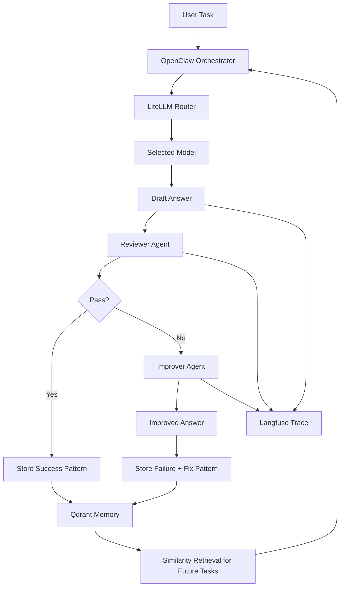

# 全体アーキテクチャ

## コンポーネントの役割

### OpenClaw
- タスク受付
- 使用ツールの決定
- ループ実行の起点

### LiteLLM
- モデルルーティング
- タスク種別ごとのモデル切替
- コスト/速度/品質のトレードオフ制御

### Langfuse
- トレース保存
- 回答/レビュー/改善の全ログ保存
- スコア可視化

### Reviewer Agent
- 回答の採点
- 失敗理由分類
- 改善の方向性提示

### Improver Agent
- レビューをもとに改良版を作る
- 同じ失敗の再発を減らす

### Qdrant
- 成功例・失敗例・修正版の記憶
- 次回の類似タスク検索

---

## 実務向けの重要ポイント

単に「失敗した」を記録するだけでは弱いです。
以下を最低限保存してください。

- タスク種別
- 入力要約
- 初回回答
- レビュースコア
- 失敗カテゴリ
- 改善版回答
- 最終採用版
- 使用モデル
- レイテンシ
- コスト

これにより、後から

- どのモデルがどのタスクに強いか
- どんな失敗が多いか
- 改善版がどれだけ効いたか

を見返せます。

