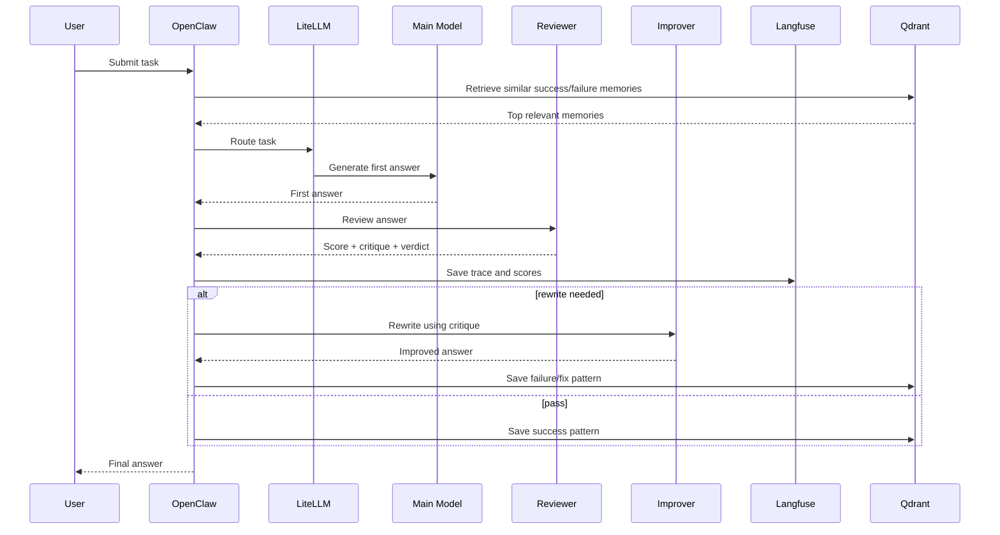

```mermaid
sequenceDiagram
    participant U as User
    participant O as OpenClaw
    participant L as LiteLLM
    participant M as Main Model
    participant R as Reviewer
    participant I as Improver
    participant F as Langfuse
    participant Q as Qdrant

    U->>O: Submit task
    O->>Q: Retrieve similar success/failure memories
    Q-->>O: Top relevant memories
    O->>L: Route task
    L->>M: Generate first answer
    M-->>O: First answer
    O->>R: Review answer
    R-->>O: Score + critique + verdict
    O->>F: Save trace and scores
    alt rewrite needed
        O->>I: Rewrite using critique
        I-->>O: Improved answer
        O->>Q: Save failure/fix pattern
    else pass
        O->>Q: Save success pattern
    end
    O-->>U: Final answer
```
