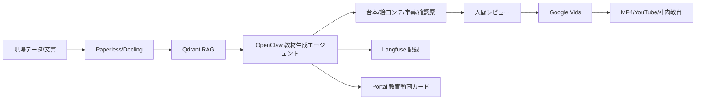

# 01 Architecture: Google Vids × OpenClaw 教育自動生成システム

## 全体像

## 役割分担

### OpenClaw側
- 文書検索
- 根拠抽出
- 不具合原因の整理
- IATF条項との紐付け
- 台本作成
- NG/OK例の構成
- 公開禁止情報の検出
- 生成履歴の記録

### Google Vids側
- アバター生成
- ナレーション生成
- BGM生成
- シーン生成
- YouTube/MP4出力

## 本番での重要ルール

Google Vidsに直接「不具合報告書を読ませて動画化」しないこと。
必ずOpenClaw側で以下を生成してからVidsへ渡す。

- 公開用要約
- マスク済み台本
- シーン別プロンプト
- ナレーション原稿
- 表示テロップ
- 承認チェックリスト

## 推奨モード

### Mode A: 半自動・安全重視
人間がGoogle Vidsにプロンプトを貼り付ける。最初はこちらを推奨。

### Mode B: 自動下書き生成
OpenClawが台本・絵コンテ・Vids用プロンプトを生成し、Portalからダウンロード。

### Mode C: 完全自律候補
新規不具合や監査記録を検出し、教育動画案を自動生成。ただし公開前承認は必須。
