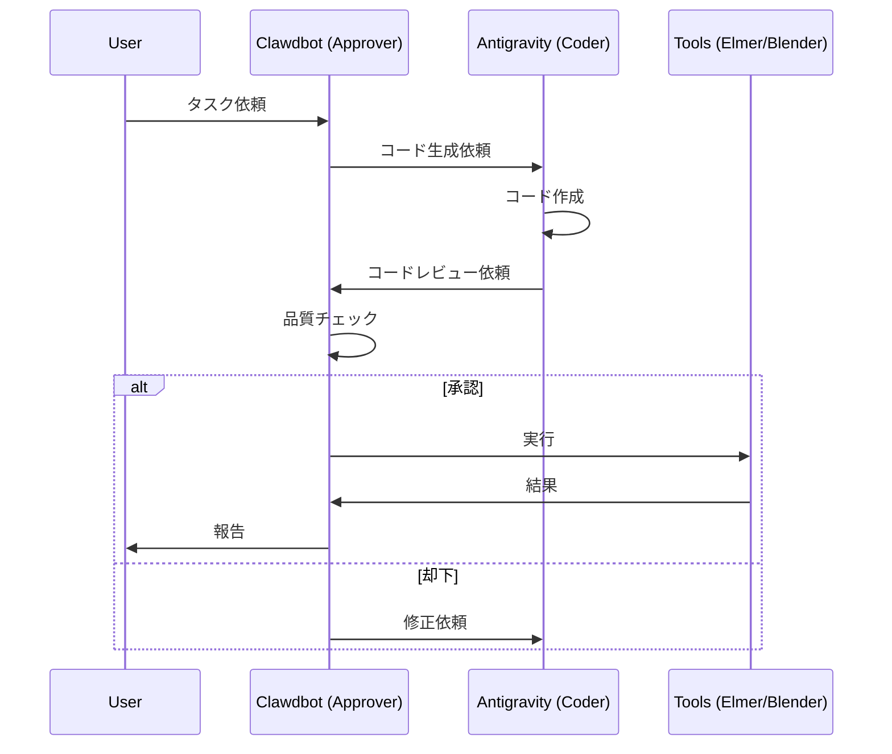

# DUAL-AGENT WORKFLOW PROTOCOL (DAP-2026)

> **Version:** 1.0
> **Date:** 2026-02-06
> **Purpose:** Clawdbot (Approver) + Antigravity (Coder) の役割分担を定義

---

## 1. アーキテクチャ

```
┌─────────────────────────────────────────────────────────┐
│                    Docker Container                      │
│  ┌─────────────────┐     ┌─────────────────────────┐    │
│  │   Antigravity   │────▶│      Clawdbot           │    │
│  │  (Gemini Pro)   │     │    (gemini-2.5-flash)   │    │
│  │     Coder       │     │      Approver           │    │
│  └─────────────────┘     └─────────────────────────┘    │
│         │                          │                     │
│         ▼                          ▼                     │
│  ┌─────────────────────────────────────────────────┐    │
│  │          Engineering Tools (Docker)              │    │
│  │  Elmer | OpenFOAM | Blender | ParaView | Godot  │    │
│  └─────────────────────────────────────────────────┘    │
└─────────────────────────────────────────────────────────┘
```

## 2. 役割定義

### 🧠 Antigravity (Coder)

- **モデル:** Gemini 3 Pro (High Spec)
- **責任:**
  - コード生成 (.sif, .py, .geo, .scad)
  - シミュレーション設定の作成
  - エラー修正・デバッグ
  - 技術的判断・設計

### 🤖 Clawdbot (Approver)

- **モデル:** gemini-2.5-flash (Fast Review)
- **責任:**
  - 生成コードのレビュー
  - 実行承認/却下
  - 品質管理
  - ユーザーへの報告

## 3. ワークフロー



## 4. レビュー基準

Clawdbot は以下の観点でコードをレビュー:

1. **構文エラーがないか**
2. **パスが正しいか** (Docker内パス使用)
3. **セキュリティリスクがないか**
4. **リソース消費が妥当か**

## 5. 実行コマンド

### Antigravity 呼び出し (Docker内)

```bash
aider --model gemini/gemini-pro "タスク内容"
```

### Clawdbot レビュー

Clawdbot は生成されたファイルを確認し、問題なければ実行。

## 6. 参照ドキュメント

- `docs/CLAWDBOT_OPERATIONAL_GUIDE.md`
- `SOUL.md` (Rule 11: Dual-Agent Protocol)

---
*Established by Antigravity for Clawdbot Autonomous Engineering*
