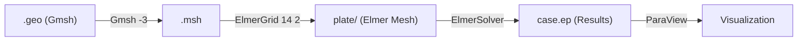

# Elmer FEM Workflow Guide (Clawdbot Environment)

> **Last Updated:** 2026-02-06
> **Status:** Verified Working

## 1. Overview

This guide documents the complete workflow for running Elmer FEM simulations in the Clawdbot environment (Docker Brain + Windows Host Brawn).

## 2. Prerequisites

| Tool | Location | Purpose |
|------|----------|---------|
| **Gmsh** | Docker (`/usr/bin/gmsh`) | Mesh Generation |
| **ElmerGrid** | Host (`C:\Program Files\Elmer 26.1-Release\bin\`) | Mesh Conversion |
| **ElmerSolver** | Host (`C:\Program Files\Elmer 26.1-Release\bin\`) | FEM Solver |

## 3. Workflow



### Step 1: Create Geometry (`.geo`)

```geo
// Use out[] array for extruded surfaces!
out[] = Extrude {0, 0, T} { Surface{1}; };
Physical Surface("Bottom_Inlet") = {1};
Physical Surface("Top_Outlet") = {out[0]};
Physical Surface("Side_Walls") = {out[2], out[3], out[4], out[5]};
Physical Volume("Body") = {out[1]};
```

> ⚠️ **CRITICAL:** After `Extrude`, surface IDs change. Use `out[]` array, not hardcoded IDs.

### Step 2: Generate Mesh (Docker)

```bash
docker exec clawdbot-gateway gmsh -3 /path/to/model.geo -o /path/to/model.msh -format msh2
```

### Step 3: Convert to Elmer Format (Host)

```powershell
& "C:\Program Files\Elmer 26.1-Release\bin\ElmerGrid.exe" 14 2 model.msh -autoclean
```

This creates a `model/` directory with:

- `mesh.nodes`, `mesh.elements`, `mesh.boundary`, `mesh.header`, `mesh.names`

### Step 4: Create `ELMERSOLVER_STARTINFO`

```
model.sif
1
```

> ⚠️ **REQUIRED:** ElmerSolver won't run without this file.

### Step 5: Create `.sif` File

**Key Settings:**

```sif
Header
  Mesh DB "." "plate"
  Results Directory "."
End

Simulation
  Post File = "case.ep"  ! <-- RELIABLE output method
End

! Boundary Conditions - MUST match mesh.names IDs
Boundary Condition 1
  Target Boundaries(1) = 1  ! Bottom_Inlet
  Velocity 3 = 0.01  ! Inflow
End

Boundary Condition 2
  Target Boundaries(1) = 2  ! Top_Outlet
  External Pressure = 0
End

Boundary Condition 3
  Target Boundaries(1) = 3  ! Side_Walls
  Velocity 1 = 0
  Velocity 2 = 0
  Velocity 3 = 0
End
```

### Step 6: Run Solver (Host)

```powershell
Set-Location "D:\path\to\project"
& "C:\Program Files\Elmer 26.1-Release\bin\ElmerSolver.exe"
```

## 4. Troubleshooting

| Symptom | Cause | Fix |
|---------|-------|-----|
| `Unable to find ELMERSOLVER_STARTINFO` | Missing config file | Create file with `.sif` filename |
| No output files generated | Missing/wrong BCs | Check `mesh.names` for BC IDs |
| Solver finishes in 0.1s | No flow (trivial solution) | Add proper Inlet/Outlet BCs |
| `Nonlinear System...not found` warnings | Normal for ResultOutputSolver | Ignore (doesn't affect results) |
| VTU files not created | ResultOutputSolver issue | Use `Post File = "case.ep"` instead |

## 5. File Locations (Clawdbot Standard)

```
data/workspace/projects/elmer/
├── plate.geo           # Geometry definition
├── plate.msh           # Gmsh mesh output
├── plate.sif           # Solver input file
├── ELMERSOLVER_STARTINFO
└── plate/              # Elmer mesh directory
    ├── case.ep         # Results (1.5MB+)
    ├── mesh.nodes
    ├── mesh.elements
    ├── mesh.boundary
    ├── mesh.header
    └── mesh.names      # BC ID mapping
```

## 6. Brain & Brawn Division

| Task | Executor | Command |
|------|----------|---------|
| Mesh Generation | Docker (Gmsh) | `docker exec ... gmsh -3` |
| Mesh Conversion | Host (ElmerGrid) | `& "C:\...ElmerGrid.exe" 14 2` |
| Solve | Host (ElmerSolver) | `& "C:\...ElmerSolver.exe"` |
| Visualization | Host (ParaView) | Open `case.ep` |

---
*Documented by Antigravity for Clawdbot Knowledge Base*
