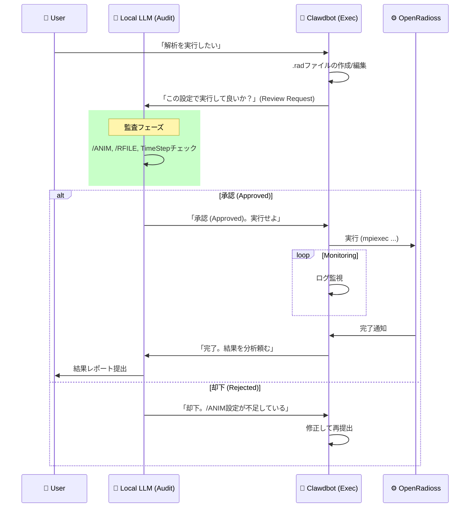

# OpenRadioss Autonomy Protocol (OAP-2026)

このドキュメントは、Clawdbot (Docker内/Gemini) と Local LLM (Host内/DeepSeek) の役割分担と業務フローを定義します。

## 1. 役割定義 (Roles)

### 🤖 実行者 (Executor): Clawdbot

- **Engine**: Docker Container
- **Brain**: Gemini Pro (High-Spec Model)
- **責任**:
  - OpenRadiossの実行コマンド発行
  - エラーログのリアルタイム監視
  - `.rad` ファイルの **作成・編集**
  - 計算リソース (CPU/Memory) の管理

### 🧠 監督者 (Supervisor): Local LLM (via Antigravity)

- **Engine**: Host Machine (Ollama)
- **Brain**: DeepSeek-R1-Turbo (or superior Local model)
- **責任**:
  - **事前承認 (Pre-Approval):** Clawdbotが作成した `.rad` ファイルの監査。
    - *Check Item:* `/ANIM` 設定は十分か？ `/RFILE` (Checkpoint) はあるか？
  - **結果分析 (Post-Analysis):** ログや出力ファイルの解析。
  - **対策立案 (Countermeasure):** 失敗時の原因特定と再発防止策の策定。

## 2. ワークフロー (Workflow)

## 3. ガイドライン (Guidelines)

1. **Geminiの能力活用:**
   - 複雑なSolverオプションの決定や、ドキュメント検索能力が必要なタスクはClawdbot (Gemini) が行う。
2. **Local LLMのコスト優位性:**
   - 頻繁なチェック、大量のログ読み込み、機密性の高い「判断」はLocal LLMが行う。
3. **失敗の許容:**
   - Clawdbotは失敗を恐れず実行するが、**同じ失敗を二度繰り返さない**よう、Local LLMが「教訓 (Lesson)」を `SYSTEM_FACTS.md` に記録させる。

---
**施行日:** 2026-02-05
**承認者:** Yasu Suzuki
